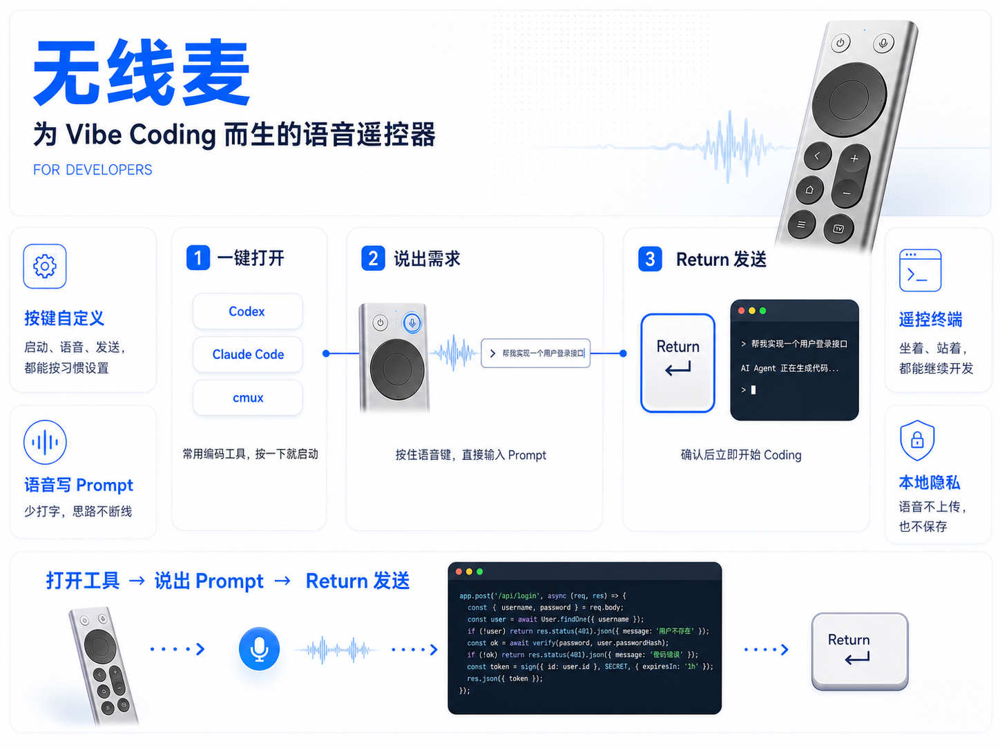
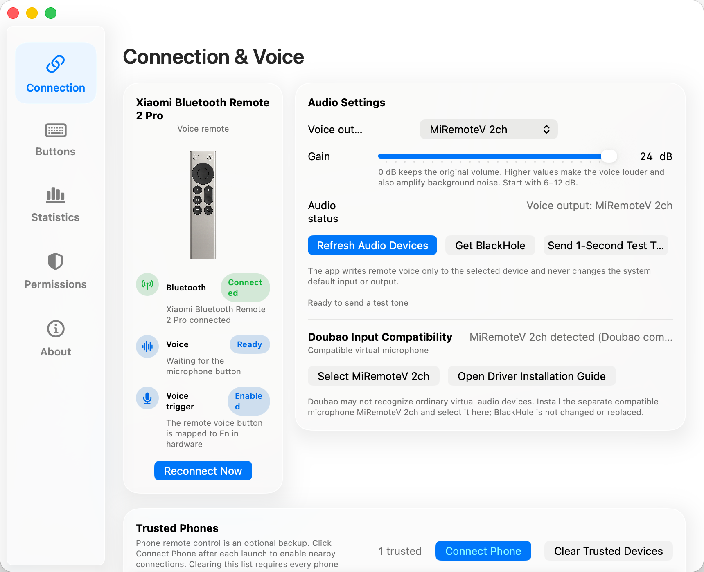
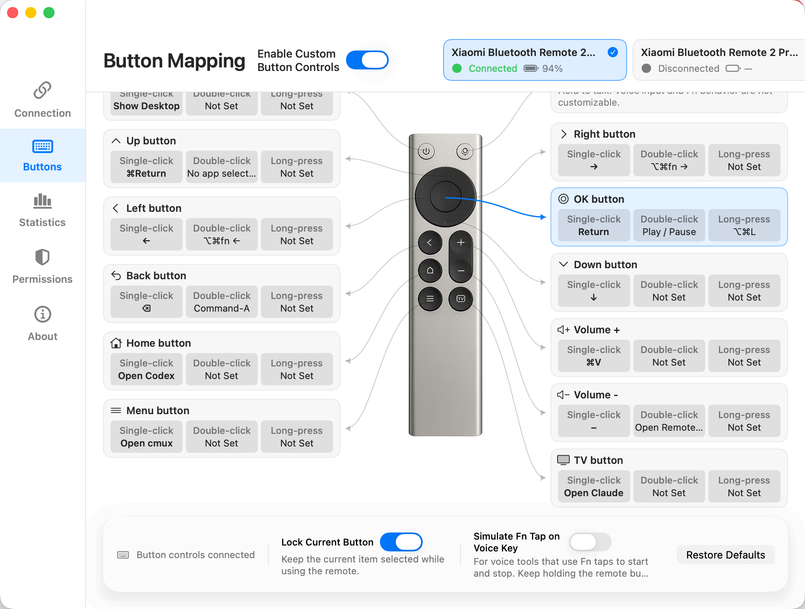
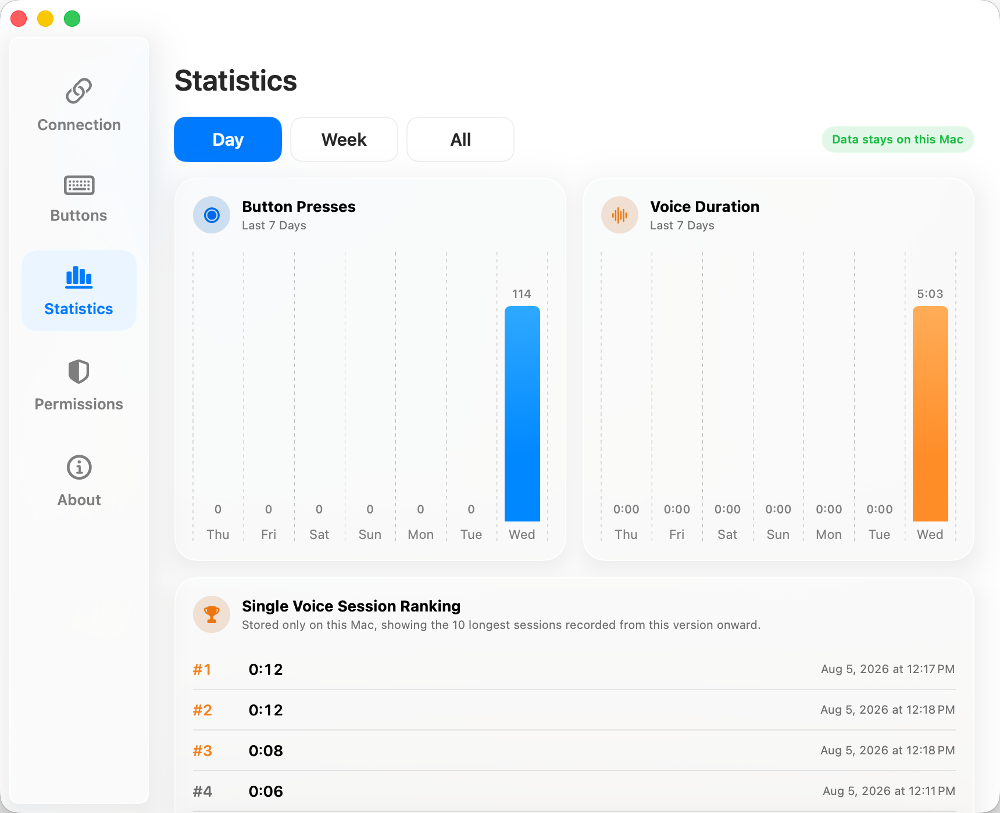

# SayAll · local Cantonese transcription fork

[简体中文](README.md) · [Fork source](https://github.com/unfla-sh/MiRemote2Pro-Whisper) · [Issues](https://github.com/unfla-sh/MiRemote2Pro-Whisper/issues)

This fork adds on-device Cantonese and English transcription from a Hugging Face Whisper model. It is independent of the original SayAll site, downloads, TestFlight, WeChat group, and Doubao or WeChat input methods. Some feature descriptions below are inherited from upstream and still need review.

**SayAll does more than listen. It also acts and helps you remember.**

**Speak to type. Press once to do more. Revisit what you said.**

SayAll is a macOS app that turns a compatible Bluetooth voice remote into a wireless microphone for your Mac. It starts with effortless voice input, then connects common actions, app-specific button profiles, and the words you explicitly choose to keep.

SayAll is built natively with SwiftUI. While running in the background, it uses less than 0.5% CPU and around 50 MB of memory—lighter than a single Chrome tab.

<picture>
  <source media="(prefers-color-scheme: dark)" srcset="Screenshots/connection-and-voice-dark-en.png">
  
</picture>

## SayAll does more than listen

### Speak to type

Hold to speak and release to stop. Add text to the app you are using without interrupting a meeting or pausing your music. SayAll does not automatically change the Mac's default input or output devices.

### Press once to do more (new capability, real-world validation in progress)

Action sequences can run several supported local steps in order, then bind them to a click, double-click, or long press. They are designed for stable, repeatable workflows—not arbitrary scripts, unlimited automation, or remote execution.

### The right controls for each app (candidate capability)

One remote can keep multiple complete button profiles. Switch them manually or explicitly enable matching by the active app; unmatched apps return to the default profile. Full validation with physical remotes and third-party apps is still in progress.

### Revisit what you said (candidate capability awaiting full voice validation)

After you enable Revisit, SayAll keeps only final text entered through SayAll and organizes it by app and date on this Mac. Local Agent Access can then create separate, revocable, read-only MCP authorization for each AI client.

- Revisit and Local Agent Access are off by default.
- No audio, complete conversations, other people's replies, or surrounding text is stored.
- There is no cloud sync or cross-device sync.
- MCP uses local `stdio` and opens no HTTP or TCP listener.
- SayAll does not upload Revisit data, but a third-party AI client may send retrieved text to its cloud model.

## Requirements

- Apple Silicon Mac with macOS 14 or later, or Intel Mac with macOS 13 or later
- Xiaomi Bluetooth Remote 2 or 2 Pro
- For built-in transcription, the app downloads the Cantonese and fallback models on first use; no virtual microphone or external dictation app is required.

## Download and install

Check [this fork’s Releases](https://github.com/unfla-sh/MiRemote2Pro-Whisper/releases) for a build. If none is available, build from source. The original SayAll CDN and installers are not releases of this fork.

## First use

1. Turn on Bluetooth in System Settings.
2. Hold the remote Home and Menu buttons together to enter pairing mode.
3. Pair the device named MI RC, Xiaomi Bluetooth Remote 2 Pro, or 小米蓝牙语音遥控器.
4. Launch SayAll and grant Bluetooth access when asked.
5. To customize ordinary buttons, also grant Input Monitoring and Accessibility. Restarting the app is required only after changing those macOS permissions.

Device cards in **Connection & Voice** and **Button Mapping** prefer the custom name from macOS Bluetooth settings. Duplicate names are numbered from 1; unnamed devices keep their existing model numbering. After renaming, return to SayAll or reopen the relevant page to refresh. Offline devices keep their last known name. System name synchronization currently covers Xiaomi and Apple remotes; standalone system API checks have passed on A2854, while full compatibility of the candidate app still awaits validation.

The menu bar icon is dimmed when no device is connected and remains clickable. An active connection from a physical remote, iPhone, Apple Watch, or web remote restores its normal appearance; voice transmission uses the active icon. Hover to read the current status. A connection does not mean audio or input permissions are ready.

SayAll appears in the Dock and remains in the menu bar after launch:

- Click the Dock icon to open Settings.
- Left-click the icon to open Settings.
- Right-click the icon to show status, reconnect, logs, About, version, update, GitHub, language, and Quit actions.

SayAll opens its main window by default on ordinary launches. The **About** page at the bottom of the Settings sidebar provides version, update, version history, glossary, GitHub, language, Dock display, and launch controls. Turn off **Open main window at launch** to keep ordinary launches in the menu bar; an update relaunch still opens the main window unconditionally. Turn off **Show app icon in the Dock** to keep SayAll available only from its menu bar entry; the Dock icon can be restored from the same page.

**App Language** displays **System Default**, **简体中文**, and **English** together. The settings window, status text, menu, and built-in help follow the selection. System permission prompts and third-party panels continue to use the language selected by macOS when they are next opened.

This fork has no update feed yet. Automatic updates and upstream hardware announcements are disabled; check this fork’s Releases for builds.

## Use voice input

1. In first-run setup, select **On-device Cantonese transcription**.
2. Wait for the models to load on the audio step. The **Connection & Voice** page shows the active model and links to its Hugging Face page.
3. Focus an editable text field, hold the remote voice button while speaking, then release. Recognized text is inserted on this Mac.

A compatible external dictation app and virtual microphone remain optional for legacy workflows.

Under **Button Mapping**, the voice-button area lets you choose the default Fn/Globe behavior, a Left Command hold, a Right Command hold, or a Right Option hold. Modifier-key modes require SayAll Accessibility permission and press the selected key when voice starts, then release it when voice ends. The target voice app must support that standalone key; many apps merge both sides into a generic modifier, so verify the target app directly. Pressing another key while the modifier is held may trigger a modifier shortcut. Right Option is the least-used modifier, making it a good dedicated voice trigger, and several voice input tools accept it as their trigger key.

Fn remains the default for the remote’s hold-to-capture/release-to-stop lifecycle and optional external dictation tools. F18, F19, F20, or other uncommon keys could be added technically, but this version does not offer an arbitrary voice-key binding: the target voice app must use the same key, and RC003, iPhone, Apple Watch, Web, permissions, and input-source switching must all share one paired press/release lifecycle. Ordinary remote buttons can still use F1–F20 shortcuts.

The voice button has no single-tap, double-tap, or long-press side effects. It is reserved for the low-latency press-to-start and release-to-stop voice session. To focus the frontmost app's input field, choose **Focus Input Field** under a normal button's **Custom Actions**; it uses macOS Accessibility and never reads the field contents.

To confirm the audio path, send a one-second test tone or inspect input level in QuickTime Player's **New Audio Recording** window.

### Typeless compatibility

Tap-to-toggle voice tools such as Typeless are incompatible with the Xiaomi Bluetooth Remote 2 and 2 Pro's default Fn-hold behavior. Enable **Simulate Fn Tap on Voice Key** in the voice-button area under **Button Mapping** to send one Fn tap when the voice stream starts and a matching tap after queued audio drains. Typeless and SayAll must still select the same loopback device, and SayAll needs Accessibility permission.

You must still **hold the Xiaomi Bluetooth Remote 2 or 2 Pro voice key while speaking and release it to finish**. Both remote firmwares stop microphone audio when the key is released, so this is not continuous or hands-free recording. The mode is off by default; keep it off for Fn-hold tools such as Doubao Input Method. Missing permission or incomplete remote HID mapping automatically disables the mode and restores the default Fn-hold mapping.

### Choosing the right mode for your remote and voice tool

Remotes differ in how they record: the Xiaomi remote only records while held; the Chromecase voice remote also supports "tap once to start, tap once more to stop"; the Siri Remote adds a touch surface. Voice tools differ too: some record while a key is held, others toggle on a tap. Mismatched pairs show up as "pressing once to stop does not end recording" or "recording ends right after it starts".

The capabilities of every remote and voice tool, and the mode each combination needs (including whether **Simulate Fn Tap on Voice Key** should be on), are listed in the [Remote and Voice Tool Capability Matrix](remote/遥控器与输入工具能力矩阵.md) (in Chinese).

## Customize remote buttons

<picture>
  <source media="(prefers-color-scheme: dark)" srcset="Screenshots/key-mapping-dark-en.png">
  
</picture>

Open **Button Mapping** and enable custom mapping to change direction, OK, Back, Home, Menu, TV, Power, and volume buttons.

Each ordinary button supports a single-click action and optional double-click and long-press actions. Available actions include keyboard input, system volume, playback control, launching installed apps, focusing the frontmost input field, and custom keyboard shortcuts. A shortcut can be chosen from common combinations such as Copy, Paste, and Spotlight, assembled from an on-page standard keyboard with modifiers, F1–F20, navigation keys, a numeric keypad, or standalone left/right modifiers, or recorded from a physical keyboard as before.

**Open Custom App** lets you select any local `.app`, then either open it only, send its focus shortcut after activation, or record a target input field once and focus it automatically. Re-record the target if an app update changes its interface. SayAll does not use fixed screen coordinates or save text from the input field.

- Without double-click or long-press configuration, single-click keeps its immediate response and hold-to-repeat behavior.
- A double-click waits about 0.3 seconds so the app can distinguish a single click.
- A long press triggers after about 0.55 seconds and suppresses the single-click action.
- Buttons with a configured double-click or long-press do not hold-repeat, preventing multiple actions from firing at once.

The voice button is always reserved for voice input and does not participate in ordinary button mapping; choose Fn/Globe, Left Command, Right Command, or Right Option hold in its dedicated area.

## Usage statistics

The **Statistics** page shows remote button presses, voice duration, and the longest individual voice sessions for the selected day, week, or all-time range. All statistics stay on this Mac and are never uploaded.

<picture>
  <source media="(prefers-color-scheme: dark)" srcset="Screenshots/statistics-dark-en.png">
  
</picture>

## Local AI / Agent setup

After explicit user consent, 无线麦SayAll.app can expose local Reflections history as read-only data to Codex, Claude Code, Cursor, OpenCode, and other clients through the bundled Swift MCP Helper. No Node.js or development runtime is required.

For AI-assisted installation, consent, client connection, and verification, give the agent the [AI Installation and MCP Setup Guide](AI_SETUP.en.md).

## Permissions and privacy

- Bluetooth: connect to the remote and receive voice.
- Input Monitoring: identify ordinary remote buttons.
- Accessibility: send mapped button actions to the active app.

SayAll does not upload or store voice, does not change the system default input or output device, and does not log voice content, Bluetooth addresses, or peripheral identifiers.

## Uninstall

1. Quit SayAll.
2. Download and run `SayAll-<version>-Uninstaller.pkg` from the same GitHub Release to remove SayAll and MiRemoteV 2ch.

Uninstalling the compatible microphone does not change or remove BlackHole.

When installing over an older release, the installer recognizes legacy `/Applications/Remote Mic.app` and `/Applications/无线麦.app` bundles only when their bundle identifier is `com.hd838a.RemoteMic`. After the new **SayAll.app** has been installed and verified, matching legacy bundles are moved to Trash with collision-safe names so they remain recoverable. If Trash is unavailable, or a bundle at either legacy path is unrelated, it is left untouched.

## Troubleshooting

Read the [Troubleshooting Guide](TROUBLESHOOTING.en.md) first. The complete onboarding flow is in the [First-Install Guide](Resources/首次安装说明.en.md).

Before developing any new feature, everyone—including the repository owner, maintainers, external contributors, and automated agents—must read and follow the canonical [New Feature Development Policy](FEATURE_DEVELOPMENT.md).

For development, build, protocol, test, and release details, see the [Technical Documentation](TECHNICAL.en.md). Branch and pull-request management is defined in the [Branch and Commit Management Policy](BRANCH_MANAGEMENT.md).

## License and sources

The macOS app, driver, and related software code in this repository are GPL-3.0-only. This fork does not currently distribute an iOS app. The macOS app logo and app icon are proprietary brand assets that require a separate grant; see [LOGO-LICENSE.en.md](LOGO-LICENSE.en.md). Full copyright and third-party information is available in [COPYRIGHT.en.md](COPYRIGHT.en.md) and [THIRD_PARTY_NOTICES.md](THIRD_PARTY_NOTICES.md).

This fork derives from [HD838A/remote-mic-app](https://github.com/HD838A/remote-mic-app), which itself derives from [nijez/open-voice-bridge](https://github.com/nijez/open-voice-bridge).

The MiRemoteV 2ch naming and USB-transport compatibility approach for Doubao device enumeration were informed by [VincentKingHsu/MiRemoteVoice](https://github.com/VincentKingHsu/MiRemoteVoice) v1.0.0-beta.1 (MIT). This project does not reuse that project's binary replacement script. Instead, it independently derives MiRemoteV2ch.driver from [ExistentialAudio/BlackHole](https://github.com/ExistentialAudio/BlackHole) v0.7.1 at commit e2b22aaaba4e507a097131704bf96dabc004d9cf under GPL-3.0. The driver has a separate identity, coexists with BlackHole, and never overwrites or removes BlackHole files.
