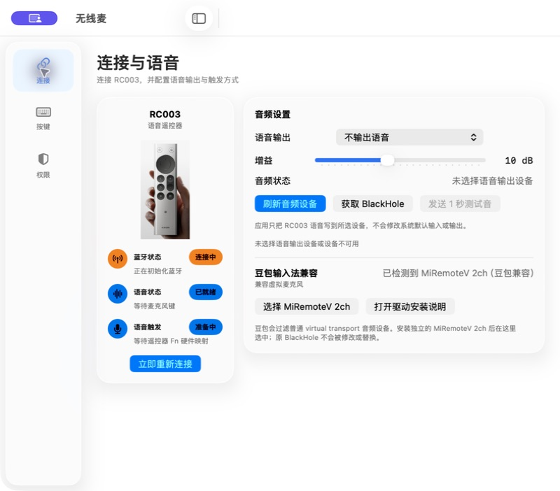
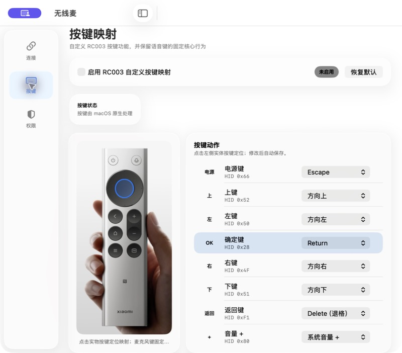
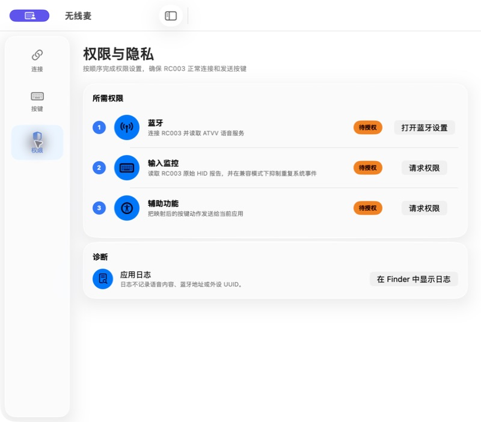

# 无线麦（Remote Mic）

无线麦是把小米蓝牙遥控器 2 Pro / RC003 变成 Mac 语音输入设备的开源菜单栏工具。当前版本为 **0.9.0（7）**，仅支持 macOS 26 和 Apple Silicon。它负责：

- 自动发现、连接和重连小米蓝牙遥控器 2 Pro / RC003：精确匹配系统显示名称 `MI RC`、`Xiaomi Bluetooth Remote 2 Pro` 或“小米蓝牙语音遥控器”（trim 后比较，英文大小写不敏感），或命中 ATVV service UUID；不做任意“小米”设备的模糊匹配；
- 接收 Android TV Voice-over-BLE（ATVV）语音并解码为 16 kHz PCM；
- 把语音送到选定的 CoreAudio 输出设备，配合 BlackHole 或项目提供的 `MiRemoteV 2ch` 作为会议、听写及 AI 应用的虚拟麦克风；
- 把 RC003 语音键真实上报的 F5 硬件按下/松开仅对该型号映射为 Mac Fn/🌐︎，应用退出时恢复原映射，用现有的 Fn 长按语音输入工具完成遥控器按住说话；
- 通过 IOHID 读取 RC003 原始按键报告，提供返回、主页、菜单、TV、音量等 macOS 动作映射。

## 界面预览

设置窗口使用 macOS 26 原生 Liquid Glass，跟随系统浅色、深色、降低透明度和增强对比度设置。窗口最小尺寸为 800×650，并支持自由缩放。

### 连接与语音



显示 RC003 连接、ATVV 语音和 Fn 触发状态，可选择语音输出设备、调整增益、发送测试音，以及选择豆包兼容的 `MiRemoteV 2ch`。

### 按键映射



点击遥控器实物图上的按键即可定位映射项。修改会自动保存，也可一键恢复默认映射；语音键仍保留固定的设备专属核心行为。

### 权限与隐私



集中显示蓝牙、输入监控和辅助功能状态，并提供系统设置跳转及本地日志诊断入口。

## 当前状态

0.9.0 已在 Apple Silicon Mac 上完成 RC003 蓝牙连接、自动重连、方向/确定/返回/主页/菜单/TV/音量按键、ATVV 语音、Fn 按住/释放、虚拟麦克风输出和真实中文语音转文字验收。应用提供 macOS 26 Liquid Glass 设置界面、完整按键映射、低音量测试音和豆包兼容虚拟麦克风。

豆包兼容驱动基于固定版本的 BlackHole `v0.7.1` 构建，设备名为 `MiRemoteV 2ch`，并报告为 USB transport，避免豆包过滤普通 virtual transport 设备。它与系统中已有的 `BlackHole 2ch` 并存，不会覆盖或修改原驱动。

## 系统要求

- macOS 26 或以上；
- Apple Silicon Mac；应用、豆包兼容驱动、安装包与 DMG 均只发布 `arm64` 架构；
- 已在“系统设置 → 蓝牙”中配对的小米蓝牙遥控器 2 Pro / RC003；
- Xcode 26 或更高版本仅在从源码构建时需要。

应用不会自行修改系统默认输入或输出设备。

## 安装与首次启动

推荐下载 `Remote-Mic-0.9.0.dmg`，然后根据需要选择一种安装方式：

1. 双击 `安装无线麦.pkg`：把应用安装到 `/Applications`，同时安装 `MiRemoteV2ch.driver`，重启 CoreAudio，并为当前桌面用户启动菜单栏应用。这是使用豆包输入法时的推荐方式。
2. 把 `无线麦.app` 拖入 `Applications`：只安装应用。此方式需要系统中已有 [BlackHole 2ch](https://existential.audio/blackhole/) 或其他可写 CoreAudio 回环设备。

应用启动后显示在菜单栏。通过“打开设置…”进入设置窗口，并按顺序完成以下授权：

1. 蓝牙：发现并连接 RC003；
2. 输入监控：读取遥控器原始 HID 报告；
3. 辅助功能：把映射后的按键动作发送给当前应用。

当前发布产物使用 ad-hoc 应用签名，PKG 未使用 Installer 证书签名，且尚未进行 Apple 公证。首次打开时可能需要在系统安全提示中确认。

## 构建

```bash
./scripts/test.sh
swift test
./scripts/build-app.sh
./scripts/verify-app.sh
open "dist/无线麦.app"
```

`scripts/test.sh` 会运行协议自测并编译完整应用，`swift test` 当前包含 38 项 Swift Testing 测试。`build-app.sh` 固定以 `arm64-apple-macosx26.0` 构建，`verify-app.sh` 会检查应用内容、签名、单一 `arm64` 架构和 Mach-O `minos 26.0`。

构建并验证完整发布产物：

```bash
./scripts/build-doubao-driver.sh
./scripts/build-doubao-driver-pkg.sh
./scripts/build-dmg.sh
./scripts/verify-dmg.sh
```

输出位于 `dist/`：

- `无线麦.app`
- `MiRemoteV2ch.driver`
- `安装无线麦.pkg`
- `卸载无线麦.pkg`
- `Remote-Mic-0.9.0.dmg`
- `Remote-Mic-0.9.0.dmg.sha256`

### 豆包兼容虚拟麦克风

如果 QuickTime 已能从 BlackHole 录到遥控器语音、豆包输入法仍没有反应，说明遥控器、ATVV 解码和回环输出已经正常；豆包是在过滤 virtual transport 设备。下载 DMG 后，双击其中的“安装无线麦.pkg”，按系统 Installer 提示授权即可；它会一次安装应用和兼容驱动，完成后自动启动状态栏应用，不需要 Xcode、Git 或终端命令。

安装器内置由固定 BlackHole `v0.7.1` 源码和项目内补丁构建的独立 `MiRemoteV2ch.driver`。实际音频 Device 报告为 USB transport，名称是 `MiRemoteV 2ch`，与 `BlackHole2ch.driver` 并存且绝不覆盖它。安装器校验应用和驱动、重启 CoreAudio 并启动菜单栏应用后，在“连接与语音”页先点击“刷新音频设备”，再在“豆包输入法兼容”中选择 `MiRemoteV 2ch`；随后在豆包中使用该设备，必要时完全重启豆包。

若要移除，双击 DMG 中的“卸载无线麦.pkg”。DMG 根目录只包含安装包、卸载包、应用和 Applications 入口；许可证材料保留在应用包内，完整对应源码由 GitHub 版本标签提供。

按键后端会先尝试设备级独占；如果 macOS 拒绝普通应用独占键盘类 HID，则自动退回非独占监听。退回后只在收到 RC003 原始按键报告后的 180 毫秒内抑制同一系统事件，降低双触发风险，并避免长期拦截其他键盘。若不授予输入监控或关闭“自定义按键映射”，macOS 仍可按普通蓝牙键盘处理它能识别的按键。

## 语音使用

1. 在应用设置中选择 `BlackHole 2ch`，或豆包兼容模式的 `MiRemoteV 2ch`，作为语音输出；
2. 在目标语音输入应用中选择同一个设备作为麦克风；
3. 按住遥控器麦克风键：macOS 会把该遥控器的真实 F5 硬件按下映射为 Fn，应用同时开始桥接 ATVV 语音；松开时硬件键直接释放 Fn 并结束语音流。

应用直接把音频写到所选设备，不会把 BlackHole 设为系统默认设备。

在不连接 RC003 的情况下，也可以在“连接与语音”页的“音频设置”中点击“发送 1 秒测试音”，验证所选设备链路是否可用：测试音只在内存生成、低音量、固定频率，不落盘；未选择设备或设备不可用时按钮不可用并给出说明；RC003 语音进行中时按钮禁用，且应用内部会再次拒绝，不会打断正在进行的语音流。

## 默认按键

| 遥控器按键 | macOS 动作 |
| --- | --- |
| 方向 / 确定 | 方向键 / Return |
| 返回 | Delete（退格） |
| 主页 | 显示桌面（Fn-F11） |
| 菜单 | Shift-F10 |
| TV | Command-Tab |
| 电源 | Escape（不会让 Mac 睡眠） |
| 音量 + / - | 系统音量增减 |

设置页使用保持原始比例的 RC003 实物图，点击真实实体按键位置会定位到右侧映射项；实物没有独立静音键，因此界面不再显示虚构的静音实体键。每个普通按键都可以改成预置动作（包括按需映射为系统静音）或禁用，选择后自动保存，也可一键恢复默认映射。语音键执行固定的“设备专属 F5→Fn 硬件映射 + ATVV 语音桥接”核心动作，不参与普通按键映射。

## 安全与隐私

- 不上传语音，不保存语音文件；PCM 只在内存与选定音频设备之间流动。
- 测试音同样只在内存生成，不落盘；不会自动更改系统默认音频设备，也不会打断正在进行的 RC003 语音流。
- 不保存真实蓝牙地址；macOS 只持久化系统提供的匿名外设 UUID。
- 权限不足、设备不匹配或音频设备不存在时失败关闭，并在设置页显示原因。
- 只有用户主动运行安装 PKG 时才会写入 `/Applications` 和 `/Library/Audio/Plug-Ins/HAL`；应用本身不会静默安装、提交、推送或发布内容。

## 来源与许可

ATVV UUID、握手、RC003 HID usage 与 IMA/DVI ADPCM 行为参考 GPL-3.0 项目 [xxb26553663-star/remote-bridge-hub](https://github.com/xxb26553663-star/remote-bridge-hub)。本适配版本统一按 `GPL-3.0-only` 发布；参考项目的品牌与商业资产不包含在本项目中。修改与归属说明见 `COPYRIGHT` 和 `THIRD_PARTY_NOTICES.md`。
